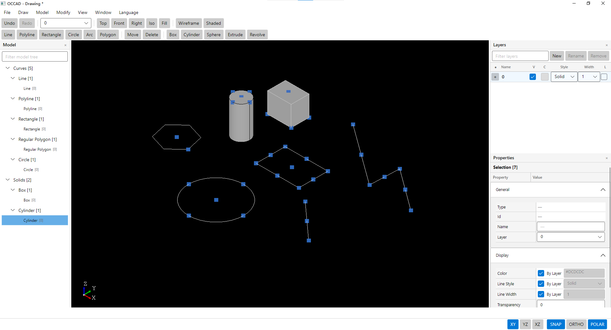

# OCCAD

OCCAD is an Avalonia desktop CAD application and extensible CAD core built on **OcctCSharpBridge / Open CASCADE Technology (OCCT)**.

[中文说明](README.zh-CN.md) · [Documentation](docs/README.md) · [User Guide](docs/en-US/13-USER-GUIDE.md) · [Feature Matrix](docs/en-US/14-FEATURE-MATRIX.md) · [Command Reference](docs/en-US/15-COMMAND-REFERENCE.md) · [Release Guide](docs/en-US/16-RELEASE-GUIDE.md)

## Preview



## Product scope

The initial OCCAD baseline focuses on a complete CAD interaction loop rather than broad feature count:

`Create → Preview → Exact Input → Commit → Property → Grip → Undo/Redo`

Core capabilities include Document / Entity / Layer, Tool / Action / Command / Transaction / History, Selection / Preselection / Subobject Selection, WorkPlane / Snap / Tracking / Precision Input, Grip / Preview / transient ownership, 2D drafting, 3D primitives, modeling features, Model Tree / Layers / Properties, localization, and OCCAD document persistence.

## Technical baseline

- .NET 10
- Avalonia 12 native `FluentTheme`
- OcctCSharpBridge SDK 3.0 / ABI 5
- Open CASCADE Technology 7.9.0
- Windows x64 / Linux x64

## UI baseline

OCCAD uses one compact classic CAD shell:

```text
Menu: File | Draw | Model | Modify | View | Window | Language

Toolbar Row 1
Undo Redo | Current Layer | Top Front Right Iso Fit | Wireframe Shaded

Toolbar Row 2
Line Polyline Rectangle Circle Arc Regular Polygon | Move Delete |
Box Cylinder Sphere Extrude Revolve

Model Tree | CAD Viewport | Layers / Properties

Fixed Tool Parameter Strip
Operation Prompt | XY YZ XZ | SNAP ORTHO POLAR
```

Design rules:

- no Ribbon;
- no more than two compact toolbar rows;
- full command surface remains in Menu;
- native Avalonia Fluent controls for normal UI;
- CAD-specific ColorTable retained;
- fixed Tool parameter strip to prevent viewport jumping;
- dark viewport and lower-left triedron;
- ViewCube disabled by default;
- no permanent Command Line, Ready text, version noise, or permanent coordinate noise.

## Initial feature surface

### 2D drafting

- Point
- Line
- Polyline
- Free Polygon
- Regular Polygon
- Rectangle
- Circle
- Arc
- Ellipse
- Spline

Circle methods: Center+Radius, Center+Diameter, Two Points, Three Points, Point+Center.

Arc methods: Three Points, Center→Start→End, Start→Center→End, Start→End→Center, Start→End→Point, Start→End→Tangent.

Ellipse methods: Center+Axes, Axis Endpoints+Minor Axis.

### 3D and curves

- Box
- Cylinder
- Cone
- Frustum
- Sphere
- Ellipsoid
- Torus
- Helix

### Modeling features

- Extrude
- Revolve
- Sweep
- Loft

### Modify

- Move
- Delete

Copy / Rotate / Scale / Mirror currently remain transaction-level Core capabilities until dedicated interactive Tools are completed and validated. Array / Offset / Trim / Extend / Fillet / Chamfer / Annotation are not part of the initial product surface.

### Interaction

- Entity / Subobject Selection
- Preselection
- Window / Crossing selection
- SNAP candidate discovery and cycling
- Grip / Hot Grip / Grip Edit
- XY / YZ / XZ WorkPlane
- ORTHO / POLAR
- exact point/length/angle/factor input
- transient Preview / Tracking ownership
- atomic Undo / Redo

## Quick start

### Windows

```powershell
git clone https://github.com/zly258/OCCAD.git
cd OCCAD
.\build.ps1
.\run.ps1
```

With a flat Bridge SDK and external OCCT runtime:

```powershell
.\run.ps1 -OcctRoot D:\tools\occt-vc144-64
```

### Linux

```bash
git clone https://github.com/zly258/OCCAD.git
cd OCCAD
./build.sh
./run.sh
```

The Bridge SDK path can be overridden with `OCCTCSHARPBRIDGE_SDK`.

## Common shortcuts

| Shortcut | Function |
|---|---|
| Esc | Cancel active Tool |
| Backspace | Step back Tool stage |
| Enter / Space | Accept / finish current stage |
| Ctrl+Z | Undo |
| Ctrl+Y / Ctrl+Shift+Z | Redo |
| F3 | SNAP |
| F8 | ORTHO |
| F10 | POLAR |
| Tab / Shift+Tab | Cycle Snap candidates |
| T / S / F | XY / YZ / XZ WorkPlane |
| Shift+middle button | Rotate view |
| Middle-button double click | Fit All |

See the [User Guide](docs/en-US/13-USER-GUIDE.md) for detailed workflows and exact-input syntax.

## Properties and Layers

Properties are driven by Core descriptors rather than UI-specific model state.

- numeric editors are left aligned;
- Layer uses a ComboBox;
- Color / LineStyle / LineWidth support ByLayer;
- Color uses OCCAD's CAD ColorTable;
- Point / Vector / Normal use X/Y/Z engineering input;
- planar `Normal` is editable for Circle / Arc / Ellipse / Rectangle / Regular Polygon;
- property edits participate in transaction/history/presentation synchronization.

Layers support current layer, visibility, locking, color, line style, line width, rename, and removal of non-default layers. Layer `0` remains protected.

## Architecture

```text
OCCAD.Avalonia
      ↓
OCCAD.Core
      ↓
OcctNet / OcctCSharpBridge
      ↓
OCCT
```

`CadWorkspace` is the composition root for one CAD session. Core is authoritative for Document, Selection, Tool lifecycle, WorkPlane, Snap, Grip, transaction/history, and transient ownership. Avalonia adapts input and presents Core state; it does not maintain a parallel CAD model.

See [Architecture](docs/en-US/04-ARCHITECTURE.md) and [Development Guide](docs/en-US/08-DEVELOPMENT-GUIDE.md).

## Build and validation

Windows authoritative build:

```powershell
.\build.ps1
```

Linux:

```bash
./build.sh
```

The repository currently does not maintain a separate Test project or use GitHub Actions as the product acceptance path. Release validation is based on local build plus real manual/native regression.

Source existence or Action registration alone does not prove product completion.

## Publish packages

Windows:

```powershell
.\publish.ps1
```

Default output:

```text
artifacts\publish\OCCAD
```

The package includes a `run.ps1` launcher. With the portable Bridge layout, native runtime and OCCT resources are packaged with the application.

Linux:

```bash
./publish.sh
```

Default outputs:

```text
artifacts/publish/OCCAD-linux-x64/
artifacts/publish/OCCAD-linux-x64.tar.gz
```

The Linux package includes `run.sh`, portable runtime, and OCCT resources.

Before creating a public release, follow the complete [Release and Delivery Guide](docs/en-US/16-RELEASE-GUIDE.md).

## Documentation

The documentation set is maintained in Chinese and English with synchronized topic numbering.

Recommended entry points:

- [Detailed User Guide](docs/en-US/13-USER-GUIDE.md)
- [Initial Release Feature Matrix](docs/en-US/14-FEATURE-MATRIX.md)
- [Command and Feature Reference](docs/en-US/15-COMMAND-REFERENCE.md)
- [Architecture Design](docs/en-US/04-ARCHITECTURE.md)
- [Developer Handbook](docs/en-US/08-DEVELOPMENT-GUIDE.md)
- [Build and Validation](docs/en-US/11-BUILD-VALIDATION.md)
- [Release and Delivery Guide](docs/en-US/16-RELEASE-GUIDE.md)

Start from [docs/README.md](docs/README.md) for the complete index.

## Release readiness

The repository is now structured and documented for an initial release. Formal Release Ready status still requires the real Windows build, application startup, core interaction regression, Save/Open regression, localization/DPI checks, and clean-directory package launch defined in the Release Guide.

## License

Original OCCAD code uses **OCCAD Non-Commercial License 1.0** from the repository root. Third-party dependencies remain under their own licenses; see `THIRD_PARTY_NOTICES.md`.
